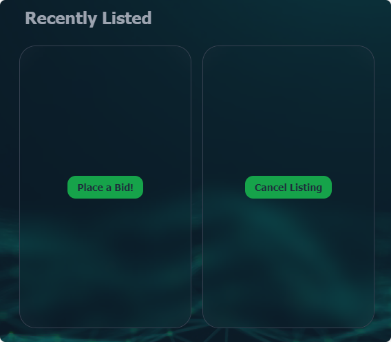
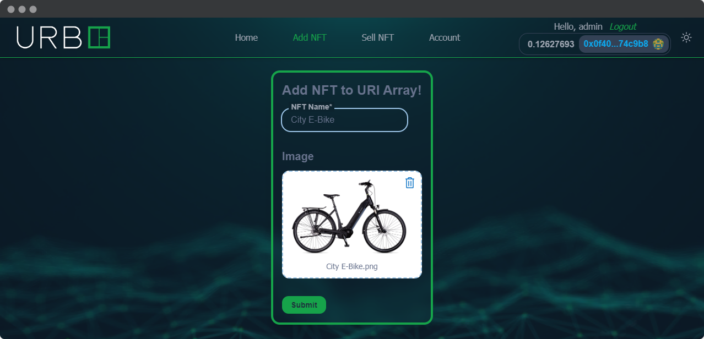
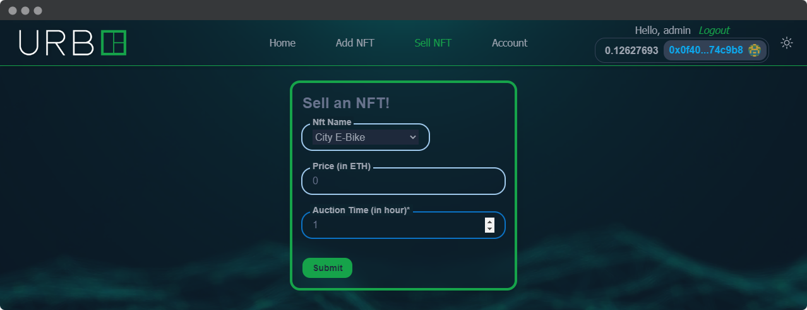
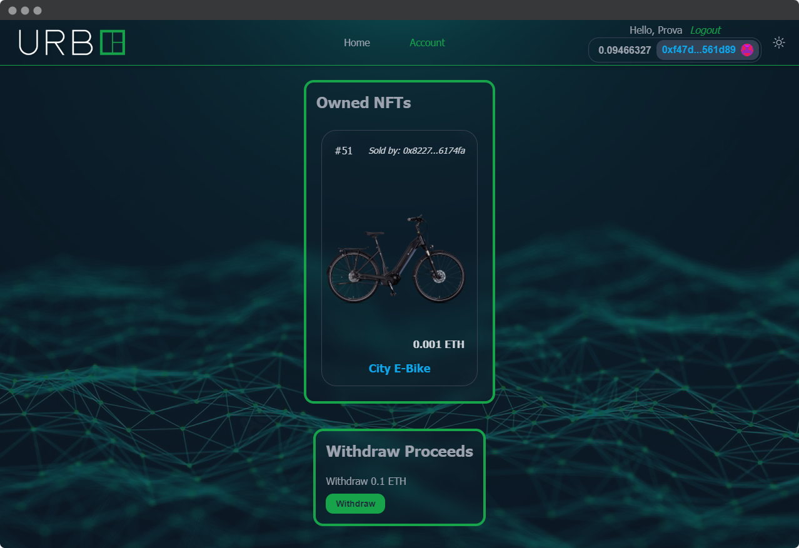

<h1 align="center">
    UrbE Auction
</h1>

<br/>

<p align="center">

</a>
</p>

<br/>

This project is a web application for a charity auction organized by UrbE, a micromobility company.

The repo contain the submodules to backend and frontend.

### Backend

The backend uses Django to handle the backend of the web application. It includes various components such as models, views, and serializers that interact with the database and handle the logic of the application. 

The Django app also includes APIs to allow communication between the frontend and the backend. 

Overall, this part of the project plays a crucial role in managing the backend and ensuring that the web application runs smoothly.

### Frontend

The frontend uses Next.js, a React framework, to handle it. It includes pages, components, and styles for the different sections of the application, such as the home page, auction details page, and user dashboard. 

It also communicates with the backend of the application, which is built using Django and hosted on Moralis, to fetch and display data such as the current auctions, bids, and user information. 

Additionally, it integrates with Moralis and Web3 to handle Ethereum transactions, including minting and bidding on NFTs.

### TheGraph

In addition to communicating with the backend, the frontend also integrates with The Graph to index events and perform queries on the Ethereum blockchain. This allows the application to display real-time data on auctions and bids and update the UI accordingly.

### Hardhat

The project uses Solidity, a programming language designed specifically for smart contracts on Ethereum, to write the auction and the NFT contract, and Hardhat to test everything.

<hr/>
  
## 🛠️&nbsp; How to run
- Install Redis if you want to keep track of the various auction bids and write the env variable in the .env file, like in the .env.example.

### Hardhat

#### Git clone the hardhat project repo

-   Clone the repo:
    ```
    git clone https://github.com/Meno96/urbe-auction-hardhat.git
    ```
-   Enter the directory:
    ```
    cd urbe-auction-hardhat
    ```
-   Install packages:
    ```
    yarn
    ```
    
#### Deploy to goerli

After installing dependencies, deploy your contracts to goerli:

```
yarn hardhat deploy --network goerli
```

### TheGraph

#### Deploy your subgraph

```
cd ..
```

Follow the instructions of the [README](https://github.com/Meno96/urbe-auction-thegraph/blob/master/README.md) of that repo.
    
### Django

- Clone the repo:
    ```
    git clone https://github.com/Meno96/urbe-auction-django.git
    ```
- Create and activate virtual enviroment
- Install requirements: --> 
    ```
    pip install -r requirements.txt
    ```
- Make database migrations: --> 
    ```
    python manage.py makemigrations
    ``` 
    ```
    python manage.py migrate
    ```
- Run server: --> 
    ```
    python manage.py runserver
    ```

### NextJS

Make sure that:

-   In your `networkMapping.json` you have an entry for `UrbEAuction` and `UrbEVehicleNft` on the goerli network.
-   Make a `.env` file and place your temporary query URL into it as `NEXT_PUBLIC_SUBGRAPH_URL`.

On other terminal:

-   Clone this repo:
    ```
    git clone https://github.com/Meno96/urbe-auction-nextjs.git
    ```
-   Enter the directory:
    ```
    cd urbe-auction-nextjs
    ```
-   Install packages:
    ```
    yarn
    ```
-   Run UI:
    ```
    yarn dev
    ```
    
### Run

Open [http://127.0.0.1:8000/](http://127.0.0.1:8000/) in your browser

## 🗎&nbsp; Requirements

* Develop the auction platform with Django.

* Set up the platform to use the default sqlite database for user data that registers and other data needed for development.
* Use the Redis database for everything related to auction bids.
* At the end of each auction, in addition to storing the information in the relational database, a JSON file must be generated containing all the details of the auction and references to the winner. Then hash this JSON and write it in a transaction on the Ethereum (Goerli) blockchain.

## 🚀&nbsp; How it's suppose to work?

The platform is based on the sale of NFTs that represent real objects, whoever appropriates the NFT at auction has the right to receive the object in question, and thanks to the blockchain this process is completely transparent.

The whole thing is based on two smart contracts (which can be seen in the Hardhat repo):
* UrbEVehicleNft: manages the various Nfts, there is the possibility to add any type of Nft to the collection when you want.
* UrbEAuction: manages the various auctions.

### Homepage

<p align="center">
    
</p>

When we log in we will be redirected to the homepage, where a warning will be shown if the IP address of the logged in admin user is different from the last one, detecting a possible intrusion by an attacker.

If we log in as an admin user we will see all the pages we can access, otherwise we will only see the Home and Account page.

In the central part of the page we can see all the various cards that represent all the NFTs that are on sale. 
On the card we see the NFT number at the top left, at the top right we see the remaining time of the auction, below we see the highest bidder, in the lower part we see the current price.

When we click on the card, it will turn around and, if we are the account that is selling that NFT, we will have the possibility to cancel the NFT listing, if instead the account is not the seller, we will have the possibility to place bids.

<p align="center">
    
</p>

### Add NFT

<p align="center">
    
</p>

If we need to add a new NFT to the collection so that we can then sell it, we just need to enter the name and a .png image of the item. Django will take care of uploading the image and the metadata of the NFT to Pinata, and then obtaining the URI and updating the array of the various URIs in the smart contract.

### Sell NFT

<p align="center">
    
</p>

To list an NFT in the auction, just enter this page, select the object you want to list, indicate the starting price (in ETH) and the auction time expressed in hours. Three transactions will need to be signed, one to mint the NFT, one to approve the smart contract to sell the NFT, and one to list the NFT.

If we go back to the home we will see our NFT listed!

### Account

<p align="center">
    
</p>

On this page we will see the NFTs we have sold if we are admin users, while if we are not admins we will see the NFTs we have bought.

By clicking on the NFT card it will turn around and we will see a button, pressing it will take us to the Etherscan page where we will be able to see the details of the transaction and in the "Input Data" field we will be able to see the details of the auction: the NFT ID, the address of the winner and the final price.

Further down there is the proceeds section, where, if present, we can withdraw them.

## 🏴‍☠️&nbsp; Other Parts

You can find the TheGraph part in [this repository](https://github.com/Meno96/urbe-auction-thegraph.git),

the Hardhat part in [this repository](https://github.com/Meno96/urbe-auction-hardhat.git),

the Django part in [this repository](https://github.com/Meno96/urbe-auction-django.git)

and the NextJS part in [this repository](https://github.com/Meno96/urbe-auction-nextjs.git)

## 💭&nbsp; My thoughts

As blockchain enthusiast, it was very satisfying and useful to develop this web application.

I am very convinced of the importance of the blockchain and its uses it could have in our everyday life and it was very nice and satisfying to develop a project that uses NFT but with real-life utility (not the usual useless images).

## 📫&nbsp; Have a question? Want to chat? 

[LinkedIn](https://www.linkedin.com/in/daniele-menin/)

[Instagram](https://www.instagram.com/danielemeno96/)
